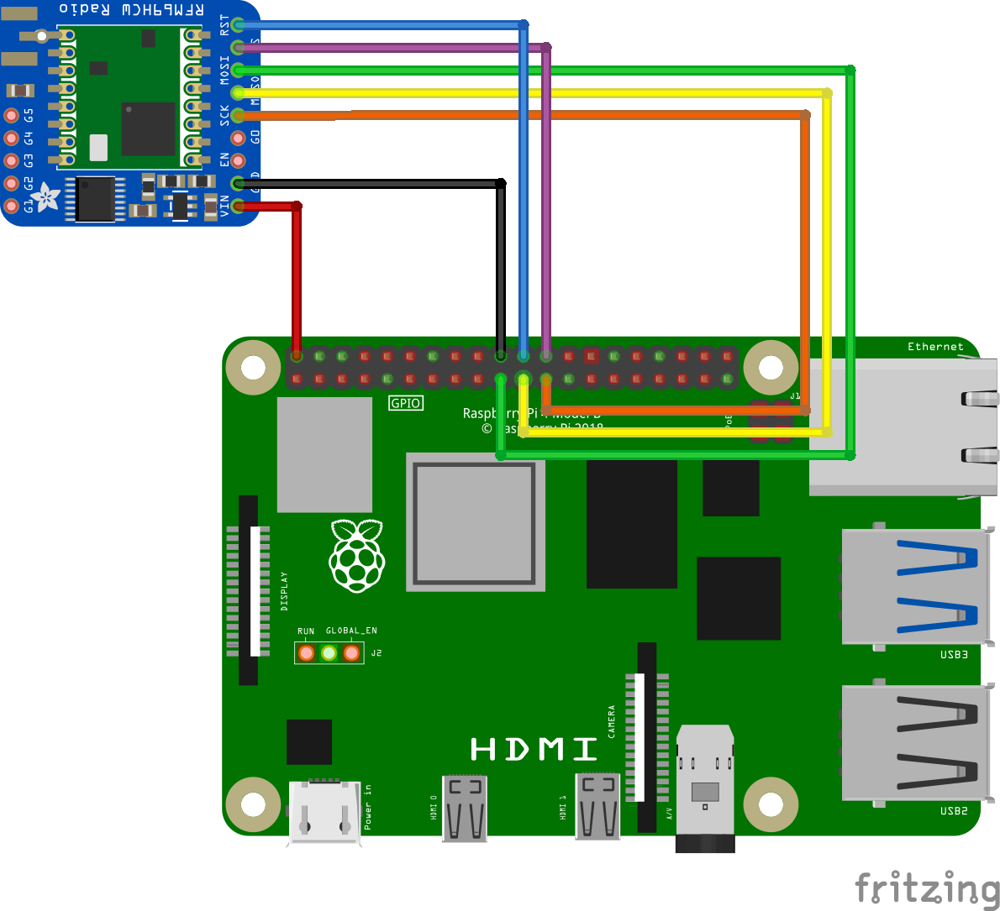

# RPI RFM69

> ⚠️ Tested on a Raspberry PI 4 running Raspbian (bullseye)

## Purpose

I made this fork in order to to make a radio communication between a Raspberry Pi 4 and a [QTPY ESP32-C3](https://www.adafruit.com/product/5405) using the [RFM69HCW](https://www.adafruit.com/product/3071).

I used [this](https://github.com/nohcpy/MicroPython_RFM69) repository for the ESP32 (which is also a fork of the circuit python implementation)

But i had struggle to find a working implementation for the Raspberry Pi 4 so I decided to fork the circuitpython implementation to have a similar version of the implementation I used for the esp32.

I didn't make many changes and my work is largely inspired by [nohcpy/MicroPython_RFM69](https://github.com/nohcpy/MicroPython_RFM69)

## Wiring the  RFM69HCW to the Raspberry Pi 4

| RFM69HCW | RPI4   |
|----------| ------ |
| VIN      | PIN 2  |
| GND      | PIN 20 |
| SCK      | PIN 23 |
| MISO     | PIN 21 |
| MOSI     | PIN 19 |
| CS       | PIN 24 |
| RST      | PIN 22 |

> VIN, GND and RST can be wired to any other equivalent pin.

# Thanks 

Many thanks for the work made on this two repo:
* [nohcpy/MicroPython_RFM69](https://github.com/nohcpy/MicroPython_RFM69)
* [jgillula/rpi-rfm69](https://github.com/jgillula/rpi-rfm69)